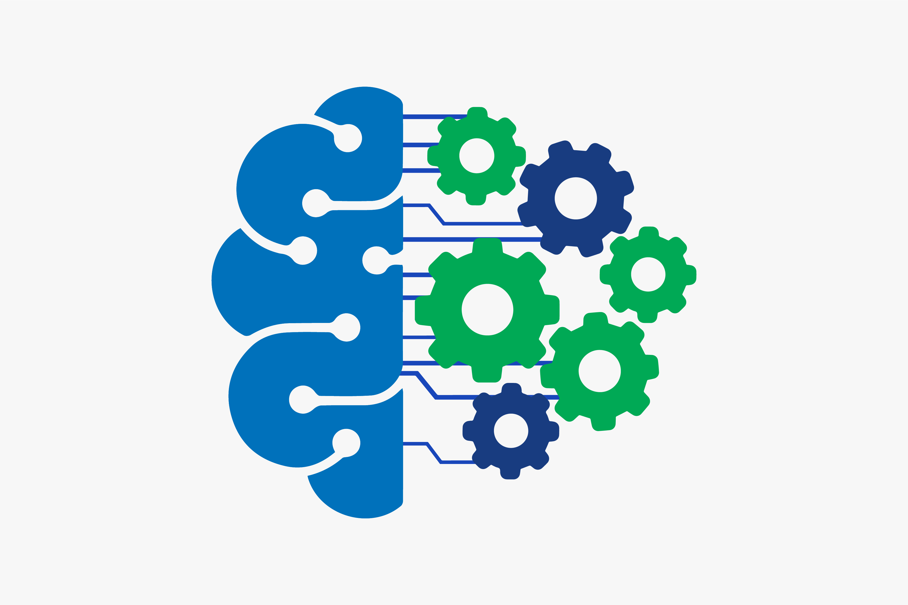

<h1>AI-Enabled-Fintech-B2B-Invoice-Management-Application</h1>
 <b>- To build a Full-Stack Invoice Management Application using Bootstrap, JDBC, JAVA, Servlets. 
- Build a responsive Receivables Dashboard. 
- Visualize Data in the form of grids. 
- Visualize Data in the form of graphs. 
- Perform Searching operations on the invoices. 
- Add & Edit data in the editable fields of the grid. 
- Delete data of selected rows in predefined templates.
</b> 
<h1>Screenshots</h1>
 
   
   
   
   
   
   
   
# Thanks
  
  

